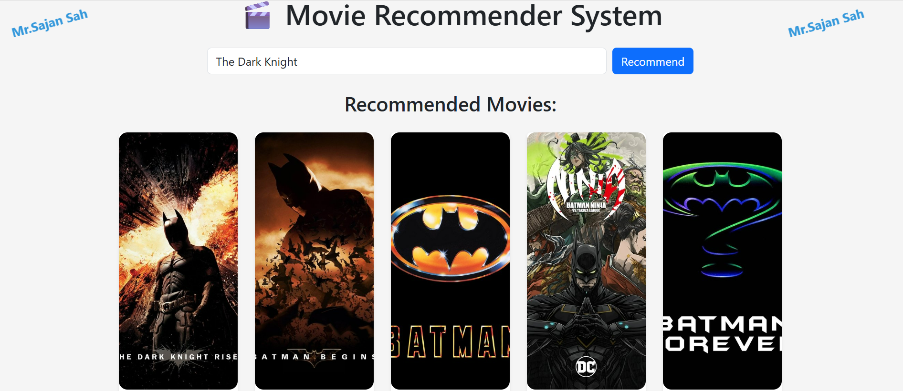

# 🎬 Movie Recommendation System with Posters

A modern, full-stack **Content-Based Movie Recommender System** built using **Flask**, **Bootstrap 5**, and **TMDb API**. Enter your favorite movie and get five similar movies with posters, genres, and a clean UI.

---

## ✨ Features

- 🔍 Search any movie and get **5 similar recommendations**
- 🖼️ Movie **poster images** powered by TMDb API
- 🎨 Stylish **responsive Bootstrap UI**
- ⚡ Fast and smooth experience
- 💼 Ready for deployment and extension

---

## 📸 Preview

---

## 🚀 Live Demo *(Optional)*

>Hosting Soon....

---

## 🗃 Dataset

This project uses the **TMDb 5000 Movie Dataset** from Kaggle:

🔗 [Download here](https://www.kaggle.com/datasets/tmdb/tmdb-movie-metadata)

Make sure you download:

- `tmdb_5000_movies.csv`
- `tmdb_5000_credits.csv`
- Create your key at https://www.themoviedb.org.

---

## 🧠 Approach Used

> ✅ **Content-Based Filtering** using movie metadata (genre, cast, keywords, overview)

- TF-IDF / CountVectorizer vectorization of metadata
- Cosine similarity for matching
- TMDb API for enriching with poster and additional details

---
📜 License
MIT © Mr. Sajan Sah

